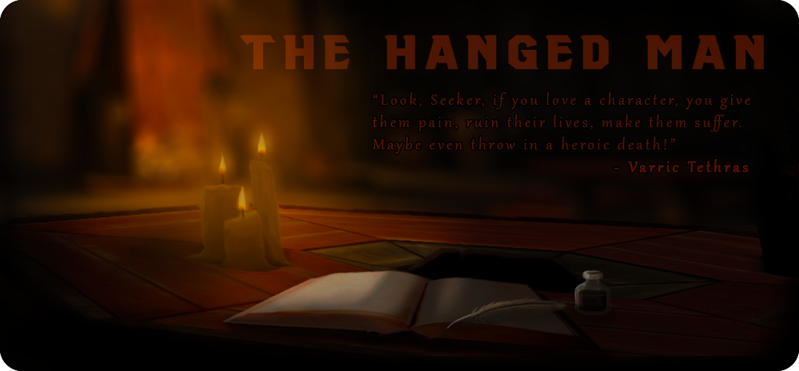

import { Card, CardGrid } from "@astrojs/starlight/components";

# Welcome to The Hanged Man

A Dragon Age fan collective for adults who enjoy thoughtful discussion, creative
fanworks, and community‑driven events. Pull up a chair — the fire’s warm, the
drinks are strong, and there’s always someone ready to talk Thedas.

## Who We Are

We’re a creator‑friendly community tucked into the corner of the Dragon Age
fandom. Inside, you’ll find deep‑dive meta, lore debates, fanworks of all kinds,
collaborative events, and good‑faith conversation that makes a fandom feel like
home.

Whether you’re here to share your latest fic, scream about your blorbo, join an
exchange, or simply lurk with a mug of something warm, you’re welcome at our
table.

## Explore The Hanged Man

Below is a quick guide to the different parts of our community — from our story
and values to events, resources, and how to join us.

<CardGrid>

<Card title="Codex">
  Our story, beliefs, and long‑term goals — the lore behind who we are and why
  this community exists.
</Card>

<Card title="The Joining">
  Everything you need to know about surviving The Joining, from expectations to
  community care.
</Card>

<Card title="Member Inventory">
  Tools, resources, playlists, and guides created by and for our community — the
  practical supplies for life inside The Hanged Man.
</Card>

<Card title="Quests">
  Our fandom events and collaborative projects, open to the wider Dragon Age
  fandom.
</Card>

<Card title="The Chantry Board">
  Leadership, our social spaces, and credits — the notices and names that keep
  the community running.
</Card>

</CardGrid>
